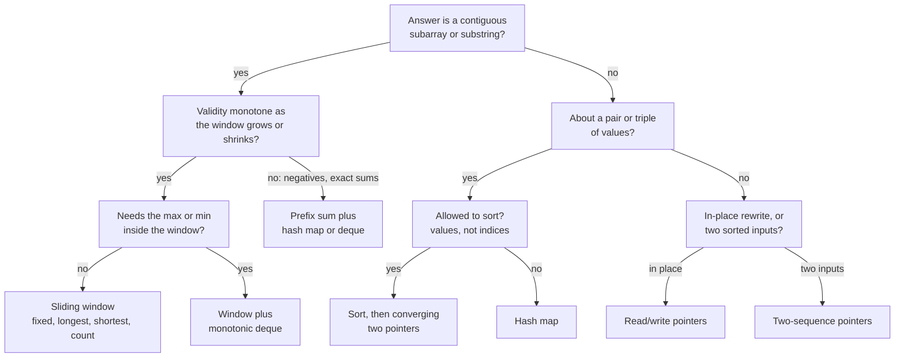

# Two Pointers vs Sliding Window — Reading Plan

Sep 24, 2026 · @Himanshu

## How to use this plan

Five sessions of about 90 minutes take you from "I know both templates" to "I can tell in 30 seconds which one a problem needs". Day 4 is the point of the plan; days 1–3 set it up, and day 5 tests it.

Every session runs the same four-step loop:

1. **Read** (20–25 min) — only the listed reading, for the stated purpose. Stop as soon as you can answer the day's question.
2. **See** (15 min) — step the named visualiser until you can predict the next frame before you click.
3. **Do** (40 min) — problems in order: worked → faded → solo. Cap each at 25 minutes; past that, read the editorial, close it, and rewrite from scratch the next day.
4. **Recall** (10 min) — close everything and write the day's template plus the one-line "why it's O(n)" from memory. Paste it to me for review.

If a session runs long, cut the reading, never the recall. Pulling the template back out of memory is what makes it stick; re-reading only feels productive.

| Lab | What it's for | Days |
| --- | --- | --- |
| [Pointers or Window?](https://claude.ai/artifact/To4wXU3jpBo4FLz6vVB8RS) (new comparison lab) | Both patterns on one pair grid, twin problems, the decision drill | 1, 4, 5 |
| [Two-Pointer Elimination](https://claude.ai/code/artifact/d830e6dc-0978-4107-ab13-a32602cca27e) | Why each step of converging pointers safely discards a whole row or column | 1 |
| [Two Pointers Workbench](https://claude.ai/code/artifact/869b8502-53a4-497f-a75d-2a1ccdd8bc8e) | Five templates, six visualisers, bug gallery | 2 |
| [3Sum Dissected](https://claude.ai/code/artifact/d6fb6805-80f0-40e4-a259-52f4d6737b9b) | Fix-one plus two pointers, and the dedup rules | 2 |
| [Sliding Window Workbench](https://claude.ai/code/artifact/62f47fe7-71d6-4a86-9976-ed5caf2fe87f) | Three shapes, need/have, the `if` vs `while` proof | 3 |

## Day 1 — One grid, two staircases

**Today's question:** there are about n²/2 (start, end) pairs, so why do both patterns finish in O(n)?

The answer to reach: each step throws away a whole row or column of the pair grid, and that is only safe because something is monotone. For two pointers it is sorted order, so `a[i] + a[j]` only grows as either index moves right. For a window it is non-negative values, so `sum(a[l..r])` grows with `r` and shrinks as `l` moves right.

- **Read** — [Competitive Programmer's Handbook, Python edition](https://www2.compute.dtu.dk/courses/02110/2025/diverse/cses-book-python.pdf), ch. 8 "Amortized analysis", section "Two pointers method" (starts p. 57). It uses exactly the two examples this plan compares: subarray sum (a window) and 2SUM (converging pointers). Its subarray example says "positive integers"; that one word is what makes the window legal. Stop before "Nearest smaller elements", which is Day 4.
- **Read** — [Tech Interview Handbook, Array](https://www.techinterviewhandbook.org/algorithms/array/), "Techniques" only. The idea to keep: a window is the special case of two pointers where both move the same way and never cross.
- **See** — [Two-Pointer Elimination](https://claude.ai/code/artifact/d830e6dc-0978-4107-ab13-a32602cca27e): rerun the Classic preset and say the row-deletion proof aloud. Then [Pointers or Window?](https://claude.ai/artifact/To4wXU3jpBo4FLz6vVB8RS), section 1: step both panels and compare cells computed against total cells.
- **Do** — on paper first. For `[1, 2, 3, 4, 6, 8, 9]` with target 14, trace Two Sum II and "shortest subarray with sum ≥ 14" on a hand-drawn 7×7 grid, noting which row or column dies at each step. Both land on the same cell by different routes; the lab's first preset lets you check. Then code [LC 167](https://leetcode.com/problems/two-sum-ii-input-array-is-sorted/) and [LC 209](https://leetcode.com/problems/minimum-size-subarray-sum/).
- **Recall** — one sentence each: which monotone fact licenses the skip, and why the step count is at most about 2n.

## Day 2 — Two pointers, three shapes

**Today's question:** when the pointers care only about the two ends, or about a write position, which shape is it?

The quickest tell is what the gap between the pointers means. In none of these three shapes is the gap the answer, and that is what separates them from a window.

| Shape | Where the pointers sit | The gap between them is | Loop header |
| --- | --- | --- | --- |
| Converging | Opposite ends, moving inward | Candidates not yet ruled out | `while i < j:` |
| Read/write | Both at the left; `read` leads | Junk already copied, waiting to be overwritten | `for read in range(n):` |
| Two sequences | One pointer per input | Nothing; they index different arrays | `while i < m and j < n:` |

- **Read** — [Hello Interview, Two Pointers overview](https://www.hellointerview.com/learn/code/two-pointers/overview), then skim [Move Zeroes](https://www.hellointerview.com/learn/code/two-pointers/move-zeroes) and [Sort Colors](https://www.hellointerview.com/learn/code/two-pointers/sort-colors) for the "pointers as region boundaries" idea.
- **Read** — [USACO Guide, Two Pointers](https://usaco.guide/silver/two-pointers), the "Sum of Two Values" solution only. Its Python builds `(value, index)` pairs before sorting. That is how you keep original indices and still use two pointers: O(n log n), against the hash map's O(n).
- **See** — [Two Pointers Workbench](https://claude.ai/code/artifact/869b8502-53a4-497f-a75d-2a1ccdd8bc8e): the Two Sum II, Move Zeroes and Sort Colors visualisers. Then [3Sum Dissected](https://claude.ai/code/artifact/d6fb6805-80f0-40e4-a259-52f4d6737b9b) for the dedup rules.
- **Do**
  1. [LC 125 Valid Palindrome](https://leetcode.com/problems/valid-palindrome/) — warm-up, converging.
  2. [LC 977 Squares of a Sorted Array](https://leetcode.com/problems/squares-of-a-sorted-array/) — converging, filling the output from the back.
  3. [LC 26 Remove Duplicates from Sorted Array](https://leetcode.com/problems/remove-duplicates-from-sorted-array/) — read/write.
  4. [LC 88 Merge Sorted Array](https://leetcode.com/problems/merge-sorted-array/) — two sequences, filling from the back.
  5. [LC 15 3Sum](https://leetcode.com/problems/3sum/) — solo, from a blank file.
  6. Stretch: [LC 881 Boats to Save People](https://leetcode.com/problems/boats-to-save-people/) — sort, then converge greedily.
- **Recall** — write the three loop headers and, for each, one line on what the gap between the pointers means.

## Day 3 — Sliding window, four shapes

**Today's question:** what state does the window carry, and when does it shrink?

The skeleton never changes: grow `r` by one, update the state, shrink `l` while a condition holds. Only two lines differ between shapes, the shrink condition and where you record the answer.

| Shape | Tell in the prompt | Shrink while | Record the answer |
| --- | --- | --- | --- |
| Fixed length | "of size k", "every k consecutive" | The window is longer than k | Every step once the window reaches k |
| Longest | "longest … such that", "at most k" | The window is invalid | After the shrink loop |
| Shortest | "minimum length … at least" | The window is still valid | Inside the loop, before each shrink |
| Counting | "number of subarrays … at most" | The window is invalid | After the loop: `count += r - l + 1` |

For "exactly k", count `at_most(k) - at_most(k - 1)`. Keep `while` as the default shrink; the workbench shows `if` only survives the longest shape.

- **Read** — Hello Interview [Fixed Length](https://www.hellointerview.com/learn/code/sliding-window/fixed-length) and [Variable Length](https://www.hellointerview.com/learn/code/sliding-window/variable-length) sliding window pages.
- **Read** — [USACO Guide, Two Pointers](https://usaco.guide/silver/two-pointers), the "Sliding Window" section (the Books problem). It calls this "two pointers" and drives the loop from `left`, extending `right`. That is the mirror image of your template and the same staircase. Names in the wild are loose; the grid picture is how you tell.
- **See** — [Sliding Window Workbench](https://claude.ai/code/artifact/62f47fe7-71d6-4a86-9976-ed5caf2fe87f): the 643, 3, 209 and 76 visualisers, then the `if` vs `while` section.
- **Do**
  1. [LC 643 Maximum Average Subarray I](https://leetcode.com/problems/maximum-average-subarray-i/) — worked, fixed.
  2. [LC 3 Longest Substring Without Repeating Characters](https://leetcode.com/problems/longest-substring-without-repeating-characters/) — faded, longest.
  3. [LC 424 Longest Repeating Character Replacement](https://leetcode.com/problems/longest-repeating-character-replacement/) — solo; this is the one still open from last session.
  4. [LC 1004 Max Consecutive Ones III](https://leetcode.com/problems/max-consecutive-ones-iii/) — longest, "at most k zeros".
  5. [LC 713 Subarray Product Less Than K](https://leetcode.com/problems/subarray-product-less-than-k/) — counting; handle `k <= 1` first.
  6. [LC 567 Permutation in String](https://leetcode.com/problems/permutation-in-string/) — fixed, with a counter.
  7. Stretch: [LC 76 Minimum Window Substring](https://leetcode.com/problems/minimum-window-substring/) — shortest, need/have.
- **Recall** — write the variable-length template once, then the two lines that change for longest, shortest and counting.

## Day 4 — Telling them apart

**Today's question:** given an unlabelled problem, which single fact decides the pattern?

Two pointers asks "what's at the ends?"; a window asks "what's inside?". Then check that the skip is legal: sortable input for pointers, monotone validity for a window. This is the long day, about two hours, so split it across two sittings if you need to.

Read it top to bottom and stop at the first leaf. A single target in sorted data sits outside the chart; that's binary search.

- **Read** — [CPH, Python edition](https://www2.compute.dtu.dk/courses/02110/2025/diverse/cses-book-python.pdf), the rest of ch. 8: "Nearest smaller elements" and "Sliding window minimum". This is what you bolt on when the window must answer "what's the min in here?".
- **Read** — [USACO Guide, Sliding Window](https://usaco.guide/gold/sliding-window), "Sliding Window Maximum in O(N)", Method 1 (deque) only.
- **Read** — [Hello Interview, Prefix Sum overview](https://www.hellointerview.com/learn/code/prefix-sum/overview) and [Subarray Sum Equals K](https://www.hellointerview.com/learn/code/prefix-sum/subarray-sum-equals-k): the fallback when negatives break the window.
- **See** — comparison lab, sections 2–5: the break-it presets, the same-direction twins, the decision flow and the twin gallery.
- **Do** — twins back to back. After each pair, put your two solutions side by side and name the one word in the prompt that changed the pattern.
  1. [LC 167](https://leetcode.com/problems/two-sum-ii-input-array-is-sorted/) → [LC 1 Two Sum](https://leetcode.com/problems/two-sum/): sorted versus unsorted with indices.
  2. [LC 209](https://leetcode.com/problems/minimum-size-subarray-sum/) → [LC 560 Subarray Sum Equals K](https://leetcode.com/problems/subarray-sum-equals-k/) → [LC 862](https://leetcode.com/problems/shortest-subarray-with-sum-at-least-k/) (editorial only): positives, then an exact count with negatives, then shortest with negatives.
  3. [LC 283 Move Zeroes](https://leetcode.com/problems/move-zeroes/) → [LC 1004](https://leetcode.com/problems/max-consecutive-ones-iii/): the same 0/1 array and direction, but the gap is junk in one and the answer in the other.
  4. [LC 1423 Maximum Points You Can Obtain from Cards](https://leetcode.com/problems/maximum-points-you-can-obtain-from-cards/) → [LC 1658 Minimum Operations to Reduce X to Zero](https://leetcode.com/problems/minimum-operations-to-reduce-x-to-zero/): "take from either end" is really a window on the middle you leave behind.
  5. [LC 392 Is Subsequence](https://leetcode.com/problems/is-subsequence/) → [LC 567](https://leetcode.com/problems/permutation-in-string/): "one string inside another" as a subsequence (two sequences) versus as a permutation (fixed window).
  6. [LC 611 Valid Triangle Number](https://leetcode.com/problems/valid-triangle-number/) → [LC 713](https://leetcode.com/problems/subarray-product-less-than-k/): both count by adding a width, one sorted and converging, one windowed.
- **Recall** — redraw the decision chart from memory, then check it against this one.

## Day 5 — Mixed set, then spaced review

**Today's question:** can you name the pattern within 60 seconds and justify it in one sentence?

- **Drill** — comparison lab, section 6: twelve unlabelled prompts. Aim for 10 of 12 on the first attempt. Below that, redo Day 4's twins before going on.
- **Timed set** — six problems you haven't seen, deliberately unlabelled and shuffled, 25 minutes each. Before typing, say four things aloud: the pattern, the monotone fact that makes the skip legal, the state you carry, and the rule for moving each pointer. If you can't do that in 60 seconds, that problem goes on the redo list.
  1. [LC 1493 Longest Subarray of 1's After Deleting One Element](https://leetcode.com/problems/longest-subarray-of-1s-after-deleting-one-element/)
  2. [LC 2824 Count Pairs Whose Sum is Less than Target](https://leetcode.com/problems/count-pairs-whose-sum-is-less-than-target/)
  3. [LC 930 Binary Subarrays With Sum](https://leetcode.com/problems/binary-subarrays-with-sum/)
  4. [LC 80 Remove Duplicates from Sorted Array II](https://leetcode.com/problems/remove-duplicates-from-sorted-array-ii/)
  5. [LC 904 Fruit Into Baskets](https://leetcode.com/problems/fruit-into-baskets/)
  6. [LC 16 3Sum Closest](https://leetcode.com/problems/3sum-closest/)
  7. Stretch: [LC 239 Sliding Window Maximum](https://leetcode.com/problems/sliding-window-maximum/)

Spaced review, counted from the day you finish Day 5. The gaps roughly double because each retrieval that takes a little effort buys a longer gap before the next.

- [ ] +2 days — redo LC 424 and LC 15 from a blank file.
- [ ] +5 days — redo LC 1658 and LC 76, then the lab drill again.
- [ ] +12 days — two random problems from Days 2–4, unlabelled, and redraw the decision chart.
- [ ] +26 days — a mock round: two problems in 45 minutes, narrated aloud as if to an interviewer.

## Resource shelf

Everything above in one place, with what to read and what to skip. All links were checked on 24 Sep 2026.

| Resource | Read | Skip for now | Day |
| --- | --- | --- | --- |
| [Competitive Programmer's Handbook, Python edition](https://www2.compute.dtu.dk/courses/02110/2025/diverse/cses-book-python.pdf) (Laaksonen, adapted by Inge Li Gørtz) | Ch. 8 "Amortized analysis", from p. 57 | The rest of the book, until the graph patterns | 1, 4 |
| [Competitive Programmer's Handbook, original](https://cses.fi/book/book.pdf) | Same chapter, from p. 77, if you prefer the C++ original | — | 1, 4 |
| [Tech Interview Handbook, Array](https://www.techinterviewhandbook.org/algorithms/array/) | "Techniques" | The question lists; your ladders are tighter | 1 |
| [Hello Interview, Two Pointers](https://www.hellointerview.com/learn/code/two-pointers/overview) | Overview, Move Zeroes, Sort Colors | Problems you've already done in the workbench | 2 |
| [Hello Interview, Fixed Length window](https://www.hellointerview.com/learn/code/sliding-window/fixed-length) and [Variable Length](https://www.hellointerview.com/learn/code/sliding-window/variable-length) | Both template pages | — | 3 |
| [Hello Interview, Prefix Sum](https://www.hellointerview.com/learn/code/prefix-sum/overview) | Overview and Subarray Sum Equals K | Count Vowels | 4 |
| [USACO Guide, Two Pointers](https://usaco.guide/silver/two-pointers) | "Sum of Two Values" and "Sliding Window" | The quiz and problem list | 2, 3 |
| [USACO Guide, Sliding Window](https://usaco.guide/gold/sliding-window) | "Sliding Window Maximum in O(N)", Method 1 | The sorted-set window and Method 2 (two stacks) | 4 |
| [Python docs, collections](https://docs.python.org/3/library/collections.html) | `Counter`, `defaultdict`, `deque` | Everything else | 3, 4 |

Three Python habits worth taking from the `collections` docs into every window problem:

- `Counter` returns 0 for a missing key, but a key set to 0 stays in the counter. `del` it when it hits zero if `len(counts)` is meant to be the number of distinct items.
- `deque` pops from either end in O(1). A `list` pays O(n) for `pop(0)`, which quietly turns an O(n) window into O(n²).
- Never slice the window (`s[l:r + 1]`) inside the loop. It copies k items each step; keep a running summary instead.
